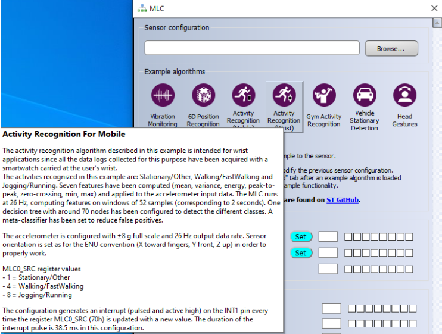

**Machine Learning Core with STM MEMS**

**Sensor LSM6DSOX**

Harris Koutsourelakis

V1.0

14 Sep 2022

**Abstract**

> This work presents the methodology to develop AI-based applications
> for Internet-of-Things environments, such as detection of a falling
> object by using the machine learning core inside the STM Mems Sensor
> LSM6DSOX and the toolchain Unico, Unicleo and WEKA.

# Table of Contents

[**Abstract** ](#_Toc119493230)

[1 **Equipment** ](#equipment)

[1.1 **B-L072Z-LRWAN1**](#b-l072z-lrwan1)

[1.2 **X-NUCLEO-IKS01A3** ](#x-nucleo-iks01a3)

[1.3 **STEVAL-MKI197V1** ](#steval-mki197v1)

[2 **Hardware Synthesis**](#hardware-synthesis)

[2.1 **Connection between B-L072Z-LRWAN1 and X-NUCLEO-IKS01A3**
](#connection-between-b-l072z-lrwan1-and-x-nucleo-iks01a3)

[2.2 **Connection between X-NUCLEO-IKS01A3 and STEVAL-MKI197V1**
](#connection-between-x-nucleo-iks01a3-and-steval-mki197v1)

[2.3 **LSM6DSOX Sensor Initialization**
](#_Toc119493238)

[3 **Firmware and Software**
](#firmware-and-software)

[3.1 **Firmware**](#firmware)

[3.2 **Unicleo-GUI**](#_Toc119493241)

[3.3 **Unico-GUI** ](#_Toc119493242)

[3.4 **Weka**](#_Toc119493243)

[4 **Implementation** ](#implementation)

[4.1 **STM32CubeIDE** ](#stm32cubeide)

[4.2 **Unicleo-GUI**](#unicleo-gui-1)

[4.3 **Machine Learning Core Example**
](#machine-learning-core-example)

[4.4 **Unico-GUI** ](#unico-gui-1)

[4.5 **Weka** ](#weka-1)

[4.6 **Video Demonstration**
](#video-demonstration)

[5 **Falling Detection Algorithm**
](#falling-detection-algorithm)

[5.1 **Creation of Falling Detection Datasets**
](#creation-of-falling-detection-datasets)

[5.2 **Project Equipment** ](#project-equipment)

[5.3 **Video Demonstration**
](#video-demonstration-1)

[5.4 **Possible Real-World Use Scenarios**
](#possible-real-world-use-scenarios)

[6 **Falling Detection Algorithm With NUCLEO-WL55JCx and SHUBv3**
](#falling-detection-algorithm-with-nucleo-wl55jcx-and-shubv3)

[6.1 **Equipment** ](#equipment-1)

[6.2 **Decision Tree Generation**
](#decision-tree-generation)

[6.2.1 **K-fold Cross-Validation**
](#k-fold-cross-validation)

[6.2.2 **J48 Algorithm (also known as C4.5)**
](#j48-algorithm-also-known-as-c4.5)

[6.3 **Performance** ](#performance)

[6.4 **Video Demonstration**
](#video-demonstration-2)

[7 **References** ](#references)

# **Equipment**

The equipment used in this project consists of the board
[B-L072Z-LRWAN1](https://www.st.com/en/evaluation-tools/b-l072z-lrwan1.html),
the [X-NUCLEO-IKS01A3 extender and the
[STEVAL-MKI197V1](https://www.st.com/en/evaluation-tools/steval-mki197v1.html).
The IKS01A3 is the extension board that provides the DIL24 socket that
the
[MKI197V1](https://www.st.com/en/evaluation-tools/steval-mki197v1.html)
(Machine Learning Core LSM6DOX) connects to in order to communicate with
the board.](https://www.st.com/en/ecosystems/x-nucleo-iks01a3.html)

## **B-L072Z-LRWAN1**

The **B-L072Z-LRWAN1**[\[1\]](#references) board was chosen specifically
for this project due to its portability, LoRaWan Connectivity and low
battery consumption.

**[B-L072Z-LRWAN1](https://www.st.com/en/evaluation-tools/b-l072z-lrwan1.html)  
**

## **X-NUCLEO-IKS01A3**

The
[X-NUCLEO-IKS01A3](https://www.st.com/en/ecosystems/x-nucleo-iks01a3.html)[\[2\]](#references)
is a is a motion MEMS and environmental sensor evaluation board system.
It is compatible with the Arduino UNO R3 connector layout and features
the LSM6DSO 3-axis accelerometer + 3-axis gyroscope, the LIS2MDL 3-axis
magnetometer, the LIS2DW12 3-axis accelerometer, the HTS221 humidity and
temperature sensor, the LPS22HH pressure sensor, and the STTS751
temperature sensor.

The X-NUCLEO-IKS01A3 interfaces with the STM32 microcontroller via the
I²C pin, and it is possible to change the default I²C port.

**  
  
  
[**X-NUCLEO-IKS01A3  **](https://www.st.com/en/ecosystems/x-nucleo-iks01a3.html)

## **STEVAL-MKI197V1**

The
[STEVAL-MKI197V1](https://www.st.com/en/evaluation-tools/steval-mki197v1.html)[\[3\]](#references)
is an adapter board designed to facilitate the evaluation of MEMS
devices in the LSM6DSO product family. The board offers an effective
solution for fast system prototyping and device evaluation directly
within the user’s own application.

STEVAL-MKI197V1

# **Hardware Synthesis**

## **Connection between B-L072Z-LRWAN1 and X-NUCLEO-IKS01A3**

**  
**

First, the **X-NUCLEO-IKS01A3** needs to be connected to the Arduino R3
pinouts of **B-L072Z-LRWAN1**. This gives the option to connect the
**STEVAL-MKI197V1** to the DIL24 socket on top of the Nucleo extender.

## **Connection between X-NUCLEO-IKS01A3 and STEVAL-MKI197V1**

Next, the **STEVAL-MKI197V1** must be connected on the **DIL24 Socket**
of the **X-NUCLEO-IKS01A3**.

**IMPORTANT**: Make sure the ST Logo on BOTH the extender and the
adapter are aligned, otherwise the adapter will overheat and most likely
lead to short-circuit.

##  **LSM6DSOX Sensor Initialization**

The **LSM6DSOX** (Machine Learning Core) sensor on the **MKI197V1** does
not communicate out of the box with the **IKS01A3**. The **LSM6DSOX**
sensor starts in **I3C**[\[4\]](#references) mode (also known as
SenseWire) because of a level shifter on the **IKS01A3** that keeps the
INT1 of the **LSM6DSOX** high, this results to **I3C** initialization by
default (as described in the Datasheet).

The only solution that was found was to bypass the INT1 and route the
INT2 in its place. That can be done by connecting the A5 pin of the
IKS01A3 to GND with a wire and also change the JP6 Jumper from the
default 5-6 to 13-14. The change of the Jumper supposedly sets the
M_INT2_0 on pin D2, in case a change needs to be made in the schematic.

**After these changes, the LSM6DSOX sensor will be enabled.**

**  
**

# **Firmware and Software**

## **Firmware**

The Firmware that was used is [the X-CUBE-MEMS1 Firmware
Package](https://github.com/STMicroelectronics/X-CUBE-MEMS1)[\[5\]](#references).

The X-CUBE-MEMS1 expansion software package for STM32Cube runs on the
STM32 and includes drivers that recognize the sensors and collect
temperature, humidity, pressure, and motion data. The expansion is built
on STM32Cube software technology to ease portability across different
STM32 microcontrollers. The software comes with a sample implementation
of the drivers running on the
X-NUCLEO-IKS01A2/X-NUCLEO-IKS01A3/X-NUCLEO-IKS02A1 expansion boards
connected to a featured STM32 Nucleo development board. The software is
also available on GitHub, where the users can signal bugs and propose
new ideas through Issues and Pull requests tabs.

**Note**: Inside the repository folder **Projects**, the only available
options are Nucleo-based projects. The ones that were tested though,
work just fine with other ST boards, since one of the **Extenders** that
are compatible (**IKS01A1/IKS01A2/IKS01A3**), are used.

## [**Unicleo-GUI**](https://www.st.com/en/development-tools/unicleo-gui.html) 

**Unicleo-GUI**[\[6\]](#references) is a graphical user interface (GUI)
for the X-CUBE-MEMS1 and X-CUBE-MEMS-XT1 software expansions and STM32
Nucleo expansion boards (X-NUCLEO-IKS01A1, X-NUCLEO-IKS01A2,
X-NUCLEO-IKS01A3 and X-NUCLEO-IKS02A1). The main objective of this
application is to demonstrate the functionality of ST sensors and
algorithms.

Unicleo-GUI is able to cooperate with firmware created by AlgoBuilder
application and display data coming from the running firmware.

The application is also able to establish Bluetooth connection with BLE
connectivity-equipped devices such as SensorTile (STEVAL- STLKT01V1),
BlueCoin (STEVAL-BCNKT01V1), and STM32 Nucleo with X-NUCLEO-IDB05A1
expansion board, BlueTile (STEVAL-BCN002V1B) or WESU1 (STEVAL-WESU1) and
read data from various device characteristics. The supported firmware
for these devices can be found at FP-SNS-ALLMEMS1, FP-SNS-ALLMEMS2,
FP-SNS-MOTENV1, FP-SNS-MOTENVWB1, STSW- BLUETILE-DK and STSW-WESU1.

## [**Unico-GUI**](https://www.st.com/en/development-tools/unico-gui.html) 

**Unico-GUI**[\[7\]](#references) is a comprehensive software package
for the evaluation boards of all MEMS sensors available in ST’s product
portfolio (accelerometers, gyroscopes, magnetometers and environmental
sensors).

The software is a cross-platform graphical user interface interacting
with STEVAL-MKI109V3 (Professional MEMS tool) which is the motherboard
compatible with all ST MEMS adapter boards. It is also possible to run
UNICO offline (without the motherboard) for generating configurations of
advanced features like the Machine Learning Core, Finite State Machine,
and pedometer.

The platform allows quick and easy setup of the sensors, as well as the
complete configuration of all the registers and advanced features (such
as the Machine Learning Core, Finite State Machine, pedometer, etc.)
embedded in the digital output devices. The software visualizes the
output of the sensors in both graphical and numeric format, and allows
the user to save or generally manage data coming from the device.

Examples of tools which support the advanced features are the following:
FIFO tool that allows the user to buffer data with a high level of
flexibility and burst the significant data out when needed; Finite State
Machine tool that allows the user to configure the state machines, test
their functionality and validate the program; Machine Learning Core tool
that allows the user to configure a machine learning core starting from
the management of data patterns and labeling to setting and generating
the configuration file to run the algorithm; FFT tool that allows
visualizing the Fast Fourier Transform of the output data; Pedometer
tool that allows the user to configure and test the pedometer embedded
in the device including an offline post-processing analysis;

## [**Weka**](https://www.cs.waikato.ac.nz/ml/index.html)

**Weka**[\[8\]](#references) contains a collection of visualization
tools and algorithms for [<u>data
anal</u>y<u>sis</u>](https://en.wikipedia.org/wiki/Data_analysis) and
[p<u>redictive
modeling</u>](https://en.wikipedia.org/wiki/Predictive_modeling),
together with graphical user interfaces for easy access to these
functions.[\#cite_note-%3A0-1)<u>1\]</u>.
Advantages of Weka include:

-   Portability, since it is fully implemented in the [<u>Java</u>
    p<u>rogramming
    language</u>](https://en.wikipedia.org/wiki/Java_programming_language)
    and thus runs on almost any modern computing platform.

-   A comprehensive collection of data preprocessing and modeling
    techniques.

-   Ease of use due to its graphical user interfaces.

Weka supports several standard [<u>data
minin</u>g](https://en.wikipedia.org/wiki/Data_mining) tasks, more
specifically, data preprocessing,
[<u>clusterin</u>g](https://en.wikipedia.org/wiki/Data_clustering),
[<u>classification</u>](https://en.wikipedia.org/wiki/Statistical_classification),
[<u>re</u>g<u>ression</u>](https://en.wikipedia.org/wiki/Regression_analysis),
[<u>visualization</u>](https://en.wikipedia.org/wiki/Data_visualization),
and [<u>feature
selection</u>](https://en.wikipedia.org/wiki/Feature_selection).

Input to Weka is expected to be formatted according the
Attribute-Relational File Format and with the filename bearing the
**.arff** extension. All of Weka's techniques are predicated on the
assumption that the data is available as one flat file or relation,
where each data point is described by a fixed number of attributes
(normally, numeric or nominal attributes, but some other attribute types
are also supported). Weka provides access to
[<u>SQ</u>](https://en.wikipedia.org/wiki/SQL)L
[databases](https://en.wikipedia.org/wiki/Database) using [<u>Java
Database
Connectivit</u>y](https://en.wikipedia.org/wiki/Java_Database_Connectivity)
and can process the result returned by a database query. Weka provides
access to [<u>dee</u>p
<u>learning</u>](https://en.wikipedia.org/wiki/Deep_learning) with
[<u>Dee</u>p<u>learning4j</u>](https://en.wikipedia.org/wiki/Deeplearning4j).[\#cite_note-4)<u>4\]</u>
It is not capable of multi-relational data mining, but there is separate
software for converting a collection of linked database tables into a
single table that is suitable for processing using
Weka.[\#cite_note-5)<u>5\]</u>
Another important area that is currently not covered by the algorithms
included in the Weka distribution is sequence modeling.

# **Implementation **

## **STM32CubeIDE**

First,
the program needs to be flashed on the board. This needs to be done with
**STM32CubeIDE**.

## **Unicleo-GUI**

After the program was flashed to the board, the sensors are initialized
and ready to be used.

This is the interface of **Unicleo**. If the board is connected via USB
(ST Link) then the Serial Port

should be automatically
selected, mine for example is COM5. **S*elect Connect***.

The sensors list will pop up and show all available sensors. Choose the
**LSM6DSOX (DIL24)**.

**Note** **that** there is also another sensor named LSM6DSO, that is
the exact same sensor, but on the extender IKS01A3 and does not contain
the Machine Learning Core.

>  style="width:5.82292in;height:3.23125in" />

After **Apply** has been selected, the following window will pop up. It
shows the sensors of the IKS01A3 and the MKI197V1 along with their
locations on the board**.**

On the left the option for
the visualization of the available sensors can be seen.

If ***MLC*** is chosen from the left, the user will be greeted by the
following window. On the first block, named ***Sensor Configuration***,
a custom ***.ucf*** dataset can be loaded. Bellow that are some
***Example Algorithms***, that, if chosen, they will be loaded and
cording to the motion of the sensor, a different value will be shown on
the ***MLC Source Registers*** bellow.

The
values will be displayed on the blocks on the right of ***MLC0_SRC***.

## **Machine Learning Core Example**

For example, here are the specifics of the ***Activity Recognition
(Wrist)*** algorithm.

According to the documentation of the algorithm:

-   **1 = Stationary/Other**

-   **4 = Walking/Fast Walking**

<!-- -->

-   **8 = Jogging/Running**

**  
**

Before an algorithm can be selected, ***Start*** must be selected on the
main window, to activate the sensor. After that, the sensor will begin
sending feedback.

Now, instead of using one of the example algorithms, a custom ***.ucf***
file will be created and used to show the configurations that need to be
set. To do that, data must be logged into a dataset based on each action
that one wants to add to the Decision Tree. The log will be created in
Unicleo (in ***.txt/ .csv*** format) and then ***Unico*** will be used
to create the ***.ucf*** file. Then the ***.ucf*** file will be loaded
to ***Weka*** to create ***Decision Tree*** and after that it will be
loaded back to ***Unico***.

*In order to log the data, the **Datalog** option needs to be chosen on
the left of the main window. Next choose the sensors that you want to
log into a file from both **Data** and **Datalog period source** ad set
a file for said activity.*

*Here, motions will be
monitored for approximately 1 minute and saved in a dataset file
**karate.csv**.  
*

The same steps will be followed for the dataset ***boxing.csv .***

## **Unico-GUI**

Now ***Unico*** needs to be used in order to create a file that can be
read by ***Weka***.

Since Unico cannot be used with the shield ***IKS01A3***, it will have
to be used in offline mode. That means that it will not connect with the
board, but the datasets will be able to be loaded in order to extract an
***.arff*** file.

Select in the **iNemo
Inertial Modules** the ***STEVAL-MKI197V1 (LSM6DSOX)*** sensor and
deselect the ***Communication with the motherboard*** option. Then click
on ***Select Device***.

After
the main window shows up, select ***MLC*** on the left and the
***Machine Learning Core*** [\[9\]](#references) window will open.

Now each one of the datasets will be loaded and set the ***Class
Label*** as ***boxing*** for the **Boxing** Dataset and **Karate** for
the Karate Dataset.

Then,
the ***Configuration*** Tab must be selected. Here are the options that
were given to the ***Decision Tree.***

The chosen options were all the ***Signed*** options ***ACC_X, ACC_Y,
ACC_Z, GY_X, GY_Z*** for the ***Mean**, **Variance**, **Energy** and
**Peak** **to** **Peak*** features.

Save the file as **.arff** and choose the desired output values of the
**Decision Tree**.

-   **1** was set for **Karate** and **2** for **Boxing**.

## **Weka**

Open
***Weka*** ***Explorer*** and load the **sports.arff** file that was
created above:

Select the ***Classify Tab*** and then ***Choose*** on the
***Classifier** **Block*** and select the ***J48*** in the tree section.
The ***Cross-Validation Folds*** option was set on 10, as default, since
it gives an approximate 98% result.

The
***Decision Tree*** has been generated, but in order to load it into
***Unico*** to create the ***.ucf*** file, the selected text, as seen in
the image below (***The tree itself***), needs to be copied and pasted
into a ***.txt*** file.

And to see the ***Decision Tree***, right click on the ***Result List***
and select ***Visualize Tree***.

Now
the **.txt** file can be loaded into the ***Unico*** window that was
left intact a while ago.

And save the file as ***sports.ucf***.

\Now the **sports.ucf** file can be loaded into **Unicleo** in the **MLC**
(Machine Learning Core) option.

**  
**

Here the changes can be seen as the value changes to **0x01** in
***MLC0_SRC*** when the board mimics the action for **Karate** .

And here ***MLC0_SRC*** changes to ***2*** when the board mimics the
action for **Boxing**.

## **Video Demonstration**

[Here is a video demonstration of
the](https://www.youtube.com/watch?v=m6ylfVGBezo) ***LSM6DSOX*** sensor
changing value from *1* to *2* when it recognizes the different actions.

> [**<u>Machine Learning Core LSM6DSOX Demonstration</u> \|\| <u>ISCA
> Lab</u>**](https://www.youtube.com/watch?v=m6ylfVGBezo)
> [\[10\]](#references)

# **Falling Detection Algorithm**

> This example is made for the use-case of detecting the Fall of the
> device from **Low** or **High altitude**. It demonstrates the change
> on the registers of the Machine Learning Core of Unicleo when the
> board is free-falling from both a low and high altitude.
>
> In order to create the datasets for both falls, a scenario was created
> for logging the Data for each case.

## **Creation of Falling Detection Datasets**

> **Low and High Altitude Fall**
>
> For both the **Low** and **High** altitude fall, 2 datasets were
> created with the board mimicking each fall, in a safe environment,
> from a height of approximately 90 centimeters for the **Low** fall and
> approximately 2.5 meters for the **High** fall.
>
> For this scenario, the mechanism that was created consisted of a small
> rubber rope attached to a thin rope, used to avoid damage from the
> force of the velocity, whereas the rope was used to simulate the fall
> by hand.
>
> Logs were taken from each scenario and then loaded into the same
> Decision Tree in order to have a single configuration for detecting
> both Falls at the same time.
>
> In the video shown below, the changes of the registers may not be
> exact at times (changing from Low to High when falling) and that is
> because of the bounce of the board due to the rubber that was used to
> simulate a safe Fall.
>
> Since the algorithm detects the data mostly from the accelerometer,
> when falling it may detect a greater value, but when the rubber
> bounces back it simulates the velocity of a Low altitude fall ,and so,
> it detects it as such. In a real-world scenario, where the board is
> not in a safe environment, the fall would be one-way and the board
> wouldn't bounce, since it would most likely not be attached to
> anything, except maybe a cable.
>
> In that scenario, the algorithm would detect only one Fall, and the
> prediction would be more precise.
>
> Although, as most uses of a Machine Learning algorithm, many datasets
> need to be logged and merged for either the **IDLE** state of the
> board or the **Falling Detection**. This will lead to a more precise
> algorithm with a variety of predictions and broader spectrum of
> detections for different scenarios, angles and falls.

## **Project Equipment**

> **<u>  
> </u>****  
> </u>****  

> **

## **Video Demonstration**

This video demonstrates the different fall detections that the Machine
Learning Core predicts from the output of the **Accelerometer** and
**Gyroscope** of the **LSM6DSOX** Sensor.

MLC Source Register ***0x70 MLC_SRC*** values in Unicleo:

-   **0x01 -\>** Value for the board being **IDLE**

-   **0x04 -\>** Value for the board falling from a **Low Altitude**

-   **0x08 -\>** Value for the board falling from a **High Altitude  
    **

[**Falling Detection with Machine Learning Core STM MEMS Sensor LSM6DSOX
\|\| ISCA Lab** \[11\]](\l)

## **Possible Real-World Use Scenarios**

A possible scenario of such a use case, such as the one shown above,
would be the use of a device with capabilities of **Bluetooth**
connectivity.

Such a scenario would prove to be a more efficient solution to provide
wireless data of a device in a monitoring database or simple real-time
feedback to a computer.

The device that was available for this demo did not have **Bluetooth**
connectivity and so such a scenario was not recorded, but would bare the
same results.

For example, both **Unico** and **Unicleo** have an option to enable
**Bluetooth** via their GUI interface. After that, the scenario of
logging the data in a remote computer/database could be explored, in the
future, for providing information of devices in case of their required
position is compromised.

# **Falling Detection Algorithm With NUCLEO-WL55JCx and SHUBv3**

This section covers the demonstration of a real use-case scenario for
the Falling Detection Algorithm that was described previously. The
microcontroller that was used is the **NUCLEO-WL55JCx**, in addition
with the **Sensor Hub v3** (**SHUBv3**) and on top of that is connected
the **MKI197v1** adapter board that uses the **LSM6DSOX** sensor to
detect any movement of the board and provide output based on the dataset
that was given to it.

In contrary with the previous demonstration, this board is not in the
supported devices of the **X-NUCLEO-MEMS1** package, and thus a custom
firmware needed to be developed, to enable communication with the
**SHUBv3** and the **MKI197v1** adapter board.

To enable the **Machine Learning Core** in this project, the LSM6DSOX
had to be included in the project manually, along with the **MLC**
option, provided by ST in their
[GitHub](https://github.com/STMicroelectronics/STMems_Standard_C_drivers/blob/master/lsm6dsox_STdC/examples/lsm6dsox_mlc.c)
repository.

In order to be able to monitor and log the data for the decision tree, a
different firmware was developed, that enabled the **Unicleo-GUI**
application and allowed the DataLog of the simulation data.

The steps that were followed were exactly the same as shown in the
sections 4.1 - 4.5, with the exception that the .ucf file was converted
into a header (.h) file and was used in the firmware. That way the
output of the **MLC** option was based registers that were given when
the Decision Tree was created.

## **Equipment**

-   WL55JCx (x = 1 or 2)

-   SHUBv3

-   WL55JCx + SensorHubV3 + MKI197v1

## **Decision Tree Generation**

The decision tree was generated based on the datasets that were logged
for this project, which include:

1.  **Idle Position**

2.  **Low Fall Detection**

3.  **High Fall Detection**

The tree was generated with WEKA, using **10-Fold Cross-Validation** and
the **J48** algorithm.

### **K-fold Cross-Validation**

Cross validation is one of the techniques used to test the effectiveness
of machine learning models and avoid overfitting. It is a re-sampling
procedure used to evaluate a model, and with the option of 5 or 10 folds
(e.g., 10-fold Cross-Validation), the procedure can be executed without
using excessive computation sources in order to train the model.

With K-fold Cross-Validation we divide the data set into k-subsets and
the procedure is repeated k-times. A training set is created, which
consists of k-1 subsets and a testing set consisting of the remaining
subsets.

For example, in 10-fold Cross-Validation, the procedure would perform a
total number of ten times, reserving 9/10 parts for training and the
remaining 1/10th for testing, each time reserving a different
tenth for testing.

### **J48 Algorithm (also known as C4.5)**

The C4.5 algorithm for building decision trees is implemented in Weka as
a classifier  
called J48. The decision trees from this algorithm are generated using
the concept of **information entropy** and can be used for
**classification**.

-   **Information entropy** is a measure of how much information there
    is in some specific data. It isn't the length of the data, but the
    actual amount of information it contains.

For example, **one text file could contain “Apples are red.” and another
text file could contain “Apples are red.** **Apples are red.**

-   **Classification** refers to a supervised learning concept which
    basically categorizes a set of data into classes.

Classifiers, like filters, are organized in a hierarchy: J48 has the
full name  
weka.classifiers.trees.J48. The classifier is shown in the text box next
to the Choose  
button: It reads J48 –C 0.25 –M 2. This text gives the default parameter
settings for this  
classifier.  
C4.5 has several parameters, by the default visualization (when you
invoke the  
classifier) only shows –c ie. Confidence value (default 25%): lower
values incur heavier  
pruning and -­‐M ie. Minimum number of instances in the two most popular
branches  
(default 2). The full set of J48 parameter settings are explained
here:  
[http://weka.sourceforge.net/doc.dev/weka/classifiers/trees/J48.html](http://weka.sourceforge.net/doc.dev/weka/classifiers/trees/J48.html%20)
.

## **Performance**

For the configuration that was given for this decision tree, the
following test summary was given by the WEKA toolchain:

| **Correctly Classified Instances**   | 51        | 80.9524 % |
| ------------------------------------ | --------- | --------- |
| **Incorrectly Classified Instances** | 12        | 19.0476 % |
| **Kappa statistic**                  | 0.7056    |           |
| **Mean absolute error**              | 0.1263    |           |
| **Root mean squared error**          | 0.3398    |           |
| **Relative absolute error**          | 29.1923 % |           |
| **Root relative squared error**      | 73.0292 % |           |
| **Total Number of Instances**        | 63        |           |

## **Video Demonstration**

The video demonstrates the values of the registers that are generated by
the Machine Learning Core based on the header file that was included in
the firmware.

**[Falling Detection with Machine Learning Core Sensor LSM6DSOX -
WL55JCx + SensorHub \|\| ISCA
Lab](https://www.youtube.com/watch?v=GsexEODn7TA)
[\[12\]](#references)**

### Power Measurement

# **References**

1.  [**B-L072Z-LRWAN1**](https://teicrete-my.sharepoint.com/personal/tp4591_edu_hmu_gr/Documents/B-L072Z-LRWAN1),
    <https://www.st.com/en/evaluation-tools/b-l072z-lrwan1.html>

2.  [**X-NUCLEO-IKS01A3**](#x-nucleo-iks01a3),
    <https://www.st.com/en/ecosystems/x-nucleo-iks01a3.html>

3.  [**STEVAL-MKI197V1**](#steval-mki197v1),
    <https://www.st.com/en/evaluation-tools/steval-mki197v1.html>

4.  [**I3C**](#_LSM6DSOX_Sensor_Initialization),
    <https://en.wikipedia.org/wiki/I3C_(bus)>

5.  [**X-CUBE-MEMS1 Firmware Package**](#firmware),

<https://github.com/STMicroelectronics/X-CUBE-MEMS1>

1.  [**Unicleo-GUI**](#_Unicleo-GUI),
    <https://www.st.com/en/development-tools/unicleo-gui.html>

2.  [**Unico-GUI**](#_Unico-GUI_1),
    <https://www.st.com/en/development-tools/unico-gui.html>

3.  [**Weka**](#_Weka), <https://www.cs.waikato.ac.nz/ml/index.html>

4.  [**Unico’s Machine Learning Core User Guide**](#unico-gui-1),

<https://www.google.com/url?sa=t&rct=j&q=&esrc=s&source=web&cd=&ved=2ahUKEwiD8Jjfh5T6AhV-hf0HHevHC7AQFnoECB8QAQ&url=https%3A%2F%2Fwww.st.com%2Fresource%2Fen%2Fuser_manual%2Fcd00297387-unico-gui-stmicroelectronics.pdf&usg=AOvVaw3QMf286kZJigIy6RPmtIM2>

1.  [**Machine Learning Core LSM6DSOX Demonstration \|\| ISCA
    Lab**](#video-demonstration),
    <https://www.youtube.com/watch?v=m6ylfVGBezo>

2.  [**Falling Detection with Machine Learning Core STM MEMS Sensor
    LSM6DSOX \|\| ISCA Lab**](#video-demonstration-1),
    <https://www.youtube.com/watch?v=tSlJXf_sjQc&feature=youtu.be>

3.  **Falling Detection with Machine Learning Core Sensor LSM6DSOX -
    WL55JCx + SensorHub \|\| ISCA Lab,**
    <https://www.youtube.com/watch?v=GsexEODn7TA>
